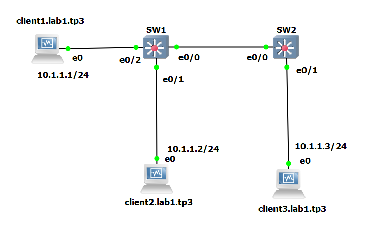
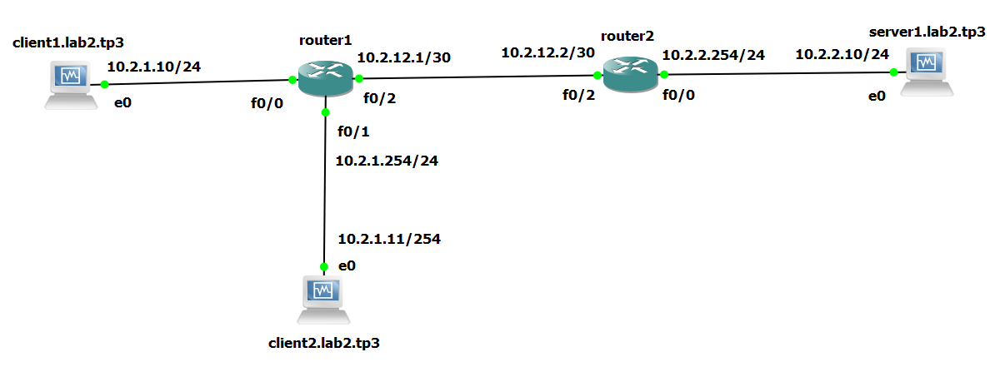
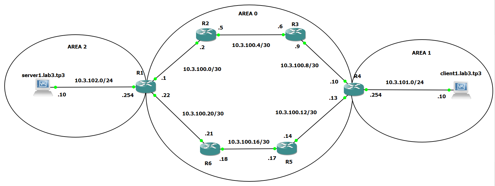

# TP 3 - Utilisation de matériel Cisco
## I. Manipulation de switches et de VLAN
### 1. Mise en place du lab

On attribue des adresses statiques et des noms de domaine aux 3 clients comme indiqué ci-dessus. Voir le [TP1](https://github.com/paralixo/b2-ccna-tp1) ou le [TP2](https://github.com/paralixo/b2-ccna1-tp2) pour la manipulation.

On vérifie que toutes les machines peuvent se `ping` :

    [florian@client1 ~]$ ping 10.1.1.2
    [florian@client1 ~]$ ping 10.1.1.3

    [florian@client2 ~]$ ping 10.1.1.1
    [florian@client2 ~]$ ping 10.1.1.3

    [florian@client3 ~]$ ping 10.1.1.1
    [florian@client3 ~]$ ping 10.1.1.2

### 2. Configuration des VLANs

On configure les VLANs directement dans les switch (clique droit sur le switch > console).

Sur `SW1` : 

    SW1# conf t

    SW1(config)# vlan 10
    SW1(config-vlan)# name client1-SW1
    SW1(config-vlan)# exit

    SW1(config)# vlan 20
    SW1(config-vlan)# name client2-SW1
    SW1(config-vlan)# exit

    SW1(config)# interface Ethernet 0/2
    SW1(config-if)# switchport mode access
    SW1(config-if)# switchport access vlan 10
    SW1(config-if)# no shut
    SW1(config-if)# exit

    SW1(config)# interface Ethernet 0/1
    SW1(config-if)# switchport mode access
    SW1(config-if)# switchport access vlan 20
    SW1(config-if)# no shut
    SW1(config-if)# exit

    SW1(config)# interface Ethernet 0/0
    SW1(config-if)# switchport trunk encapsulation dot1q
    SW1(config-if)# switchport mode trunk
    SW1(config-if)# no shut
    SW1(config-if)# exit

Sur `SW2`:

    SW2# conf t

    SW2(config)# vlan 10
    SW2(config-vlan)# name client3-SW2
    SW2(config-vlan)# exit

    SW1(config)# interface Ethernet 0/1
    SW1(config-if)# switchport mode access
    SW1(config-if)# switchport access vlan 10
    SW1(config-if)# no shut
    SW1(config-if)# exit

    SW1(config)# interface Ethernet 0/0
    SW1(config-if)# switchport trunk encapsulation dot1q
    SW1(config-if)# switchport mode trunk
    SW1(config-if)# no shut
    SW1(config-if)# exit

> En résumé :
> - établissement de VLAN 10 (ports mode access) entre client1/SW1 et client3/SW2
> - établissement de VLAN 20 (ports mode access) entre client2/SW1
> - établissement des ports entre SW1/SW2 en mode trunk

Vérification : 

 - Le ping entre `client1` et `client3` fonctionne.
 - `client2` n'est joignable par personne (car seul dans son VLAN)

Note : 

    [florian@client1 ~]$ sudo traceroute -I 10.1.1.3
    traceroute to 10.1.1.3 (10.1.1.3), 30 hops max, 60 byte packets
     1  10.1.1.3 (10.1.1.3) 5.691 ms 5.807 ms 5.751 ms

Pas de saut au niveau des switchs car `client1` et `client3` appartiennent au même VLAN, et sont donc dans le même réseau (virtuellement).

## II. Manipulation simple de routeurs
### 1. Mise en place du lab

On attribue des adresses statiques et des noms de domaine aux 2 clients et au serveur comme indiqué ci-dessus. Voir le [TP1](https://github.com/paralixo/b2-ccna-tp1) ou le [TP2](https://github.com/paralixo/b2-ccna1-tp2) pour la manipulation.

Pour les routeurs on suit cette manipulation (exemple config f0/2 sur router1): 

    router1# conf t
    router1(config)# int fastEthernet 2/0
    router1(config-if)# ip add 10.2.12.1 255.255.255.252
    router1(config-if)# no shut
    router1(config-if)# exit

On vérifie que les routeurs peuvent se `ping` et que les clients et le serveur peuvent joindre leur gateway :

    [florian@client2 ~]$ ping 10.2.1.254
    [florian@server1 ~]$ ping 10.2.2.254
    [florian@router1 ~]$ ping 10.2.12.2

### 2. Configuration du routage statique

> J'utilise une configuration temporaire pour les routes.
> On ne peut pas configurer une route statique sur client1 car il ne peut joindre personne dans son propre réseau...

Sur les clients et le serveur : 

    [florian@client2 ~]$ sudo ip route add 10.2.2.0/24 via 10.2.1.254 dev enp0s3
    [florian@server1 ~]$ sudo ip route add 10.2.1.0/24 via 10.2.2.254 dev enp0s3

Sur les routeurs : 

    router1# conf t
    router1(config)# ip route 10.2.2.0 255.255.255.0 10.2.12.2
    router1(config)# exit
    
    router2# conf t
    router2(config)# ip route 10.2.1.0 255.255.255.0 10.2.12.1
    router2(config)# exit

Vérification : 

    [florian@client2 ~]$ ping 10.2.2.10
    [florian@server1 ~]$ ping 10.2.1.11

Proposition de topologie où tous les clients auraient la même passerelle : 

???????????????????????????????????????????????

## III. Mise en place d'OSPF
### 1. Mise en place du lab

On configure les routeurs, le client et le serveur comme présenté par le schema ce-dessus (se référer aux parties précédentes du TP pour la configuration).

On vérifie que les clients et serveurs peuvent joindre leurs gateways respectives et que les routeurs peuvent discuter entre eux (de point à point) à l'aide d'un `ping`.

### 2. Configuration de OSPF

Sur R1 : 

    R1# conf t
    R1(config)# router ospf 1
    R1(config-router)# router-id 1.1.1.1
    R1(config-router)# network 10.3.100.0 0.0.0.3 area 0
    R1(config-router)# network 10.3.100.20 0.0.0.3 area 0
    R1(config-router)# network 10.3.102.0 0.0.0.255 area 2

Sur R2 : 

    R2# conf t
    R2(config)# router ospf 1
    R2(config-router)# router-id 2.2.2.2
    R2(config-router)# network 10.3.100.0 0.0.0.3 area 0
    R2(config-router)# network 10.3.100.4 0.0.0.3 area 0

Sur R3 : 

    R3# conf t
    R3(config)# router ospf 1
    R3(config-router)# router-id 3.3.3.3
    R3(config-router)# network 10.3.100.4 0.0.0.3 area 0
    R3(config-router)# network 10.3.100.8 0.0.0.3 area 0

Sur R4 : 

    R4# conf t
    R4(config)# router ospf 1
    R4(config-router)# router-id 4.4.4.4
    R4(config-router)# network 10.3.100.8 0.0.0.3 area 0
    R4(config-router)# network 10.3.100.12 0.0.0.3 area 0
    R4(config-router)# network 10.3.101.0 0.0.0.255 area 1

Sur R5 : 

    R5# conf t
    R5(config)# router ospf 1
    R5(config-router)# router-id 5.5.5.5
    R5(config-router)# network 10.3.100.12 0.0.0.3 area 0
    R5(config-router)# network 10.3.100.16 0.0.0.3 area 0

Sur R6 : 

    R6# conf t
    R6(config)# router ospf 1
    R6(config-router)# router-id 6.6.6.6
    R6(config-router)# network 10.3.100.16 0.0.0.3 area 0
    R6(config-router)# network 10.3.100.20 0.0.0.3 area 0

On ajoute une route par défaut vers la passerelle sur client1 et server1 : 

    [florian@server1 ~]$ sudo ip route add default via 10.3.102.254 dev enp0s3
    [florian@client1 ~]$ sudo ip route add default via 10.3.101.254 dev enp0s3

> Attention, la configuration de client1 et server1 est temporaire !

Vérification : 

On vérifie que server1 et client1 peuvent se joindre.

    [florian@client1 ~]$ ping 10.3.102.10
    [florian@server1 ~]$ ping 10.3.101.10

On vérifie que les routeurs peuvent se joindre entre eux.

> On sait déjà que les routeurs peuvent se ping point à point, donc je ne vais `ping` que les routeurs qui ne sont pas voisins.

    R1# ping 10.3.100.6
    R1# ping 10.3.100.10
    R1# ping 10.3.100.17

    R2# ping 10.3.100.10
    R2# ping 10.3.100.14
    R2# ping 10.3.100.21

    R3# ping 10.3.100.1
    R3# ping 10.3.100.18
    R3# ping 10.3.100.14

    R4# ping 10.3.100.18
    R4# ping 10.3.100.22
    R4# ping 10.3.100.5

    R5# ping 10.3.100.22
    R5# ping 10.3.100.2
    R5# ping 10.3.100.9

    R6# ping 10.3.100.2
    R6# ping 10.3.100.6
    R6# ping 10.3.100.13

## IV. Lab Final

### Addressage

**Mettre image de la topo ici**

|         | 10.4.100.0/30 | 10.4.100.4/30 | 10.4.100.8/30 | 10.4.100.12/30 | /24 | 
|--       |--             |--             |--             |--              |--|
| client1 | X             | X             | X             | X              |  |
| client2 | X             | X             | X             | X              |  |
| client3 | X             | X             | X             | X              |  |
| server1 | X             | X             | X             | X              |  |
| R1      | 10.4.100.1    | X             | X             | 10.4.100.14    | X |
| R2      | 10.4.100.2    | 10.4.100.5    | X             | X              | X |
| R3      | X             | X             | 10.4.100.10   | 10.4.100.13    | X |
| R4      | X             | 10.4.100.6    | 10.4.100.9    | X              |  |

On addresse les IP à nos différentes machines selon le tableau ci-dessus (se référer aux parties précédentes du TP pour la configuration).

On vérifie que les routeurs peuvent se `ping`:

    R1# ping 10.4.100.2
    R1# ping 10.4.100.13
    R2# ping 10.4.100.1
    R2# ping 10.4.100.6
    R3# ping 10.4.100.9
    R3# ping 10.4.100.14
    R4# ping 10.4.100.5
    R4# ping 10.4.100.10

### VLANs

On configure maintenant les VLANs.
Configuration entre deux switches en mode `trunk`:

    SW1# conf t
    SW1(config)# interface ???
    SW1(config-if)# switchport trunk encapsulation dot1q
    SW1(config-if)# switchport mode trunk

    SW2# conf t
    SW2(config)# interface ???
    SW2(config-if)# switchport trunk encapsulation dot1q
    SW2(config-if)# switchport mode trunk

Assignation des VLANs aux clients et serveurs. Exemple avec SW1-Client1 et SW2-Server1 :

    SW1# conf t
    SW1(config)# vlan 20
    SW1(config-vlan)# name client1-sw1
    SW1(config-vlan)# exit
    SW1(config)# interface ???
    SW1(config-if)# switchport mode access
    SW1(config-if)# switchport access vlan 20

    SW2# conf t
    SW2(config)# vlan 10
    SW2(config-vlan)# name server1-sw2
    SW2(config-vlan)# exit
    SW2(config)# interface ???
    SW2(config-if)# switchport mode access
    SW2(config-if)# switchport access vlan 10

Réiterer la manipulation pour les machines restantes.

On vérifie à l'aide de `ping`.
Ca marche :

    [mehaye@client1 ~]$ ping ??.??.??.?? (client)
    [mehaye@client1 ~]$ ping ??.??.??.??
    [mehaye@client1 ~]$ ping ??.??.??.??

Ca ne marche pas :

    [mehaye@client1 ~]$ ping ??.??.??.?? (server)
    [mehaye@client1 ~]$ ping ??.??.??.??

### OSPF

On configure l'OSPF en partageant les réseaux connus de chaque routeur : 

    R1# conf t
    R1(config)# router ospf 1
    R1(config-router)# router-id 1.1.1.1
    R1(config-router)# network 10.4.100.0 0.0.0.3 area 0
    R1(config-router)# network 10.4.100.12 0.0.0.3 area 0

    R2# conf t
    R2(config)# router ospf 1
    R2(config-router)# router-id 2.2.2.2
    R2(config-router)# network 10.4.100.0 0.0.0.3 area 0
    R2(config-router)# network 10.4.100.4 0.0.0.3 area 0

    R3# conf t
    R3(config)# router ospf 1
    R3(config-router)# router-id 3.3.3.3
    R3(config-router)# network 10.4.100.4 0.0.0.3 area 0
    R3(config-router)# network 10.4.100.8 0.0.0.3 area 0

    R4# conf t
    R4(config)# router ospf 1
    R4(config-router)# router-id 4.4.4.4
    R4(config-router)# network 10.4.100.8 0.0.0.3 area 0
    R4(config-router)# network 10.4.100.12 0.0.0.3 area 0

Normalement tout les routeurs peuvent se joindre entre eux et les clients peuvent aussi `ping` n'importe quel routeur.

### NAT

    Bordel du NAT

Notre architecture pour le Lab4 est maintenent terminé.